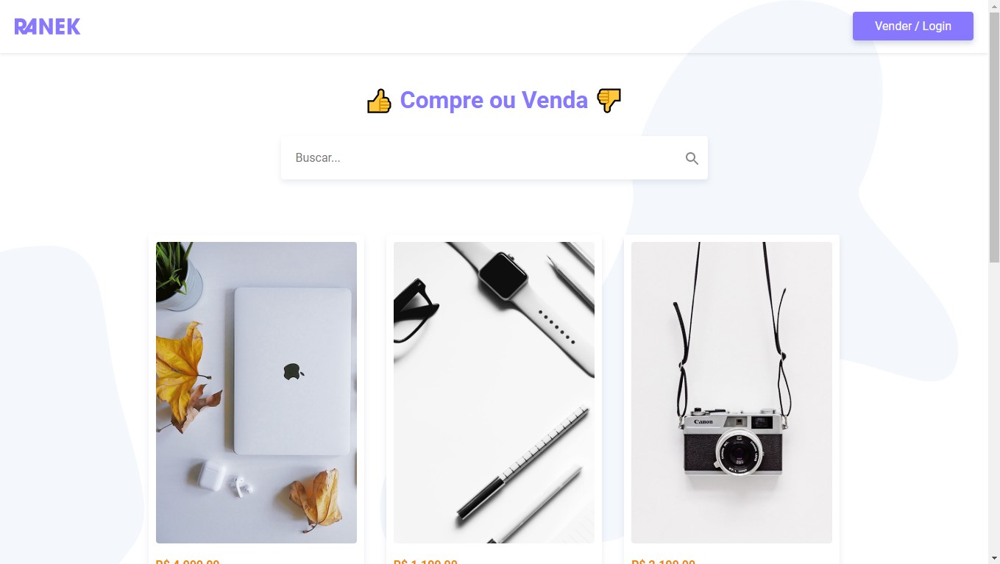
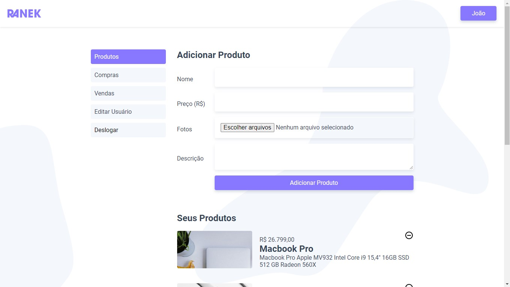

<h1 align="center">
    
    <br/>
</h1>

<p align="center">
  
  
  
   
</p>

## :bookmark: Projeto

<strong>Ranek</strong> é uma aplicação em que os usuário pode comprar e vender produtos, fazer login e a autenticação foi feita com JSON Web Token (JWT) Foi desenvolvida durante o curso de VueJS Completo da [Origamid](https://www.origamid.com/).

---

<p align="center">
  
  
<p>

---

## :rocket: Tecnologias

- [VueJS](https://vuejs.org/)
- [Vue Router](https://router.vuejs.org/)
- [Vuex](https://vuex.vuejs.org/)
- [Wordpress API](https://br.wordpress.org/)

---

## :boom: Como Executar

- ### **Pré-requisitos**

  - É **necessário** possuir o **[Node.js](https://nodejs.org/en/)** instalado no computador
  - É **necessário** possuir o **[Git](https://git-scm.com/)** instalado e configurado no computador
  - É **necessário** possuir qualquer instalador de **[Wordpress](https://br.wordpress.org/)** no computador
  - Também, é **preciso** ter um gerenciador de pacotes seja o **[NPM](https://www.npmjs.com/)** ou **[Yarn](https://yarnpkg.com/)**.
  - Por fim, é **essencial** ter o **[Vue CLI](https://cli.vuejs.org/)** instalado de forma global na máquina

---

#### :exclamation: O Frontend precisa que o Backend esteja sendo executado para funcionar.

### 🧭 Rodando o Backend

```bash
# Clone este repositório
$ git clone https://github.com/joaom00/ranek // HTTPS
$ git clone git@github.com:joaom00/ranek.git // SSH

# Copie a pasta api, que está dentro de src
# e cole dentro da pasta themes no Wordpress e depois ative esse tema


```

### 🧭 Rodando o Frontend

```bash
# Clone este repositório
$ git clone https://github.com/joaom00/ranek // HTTPS
$ git clone git@github.com:joaom00/ranek.git // SSH

# Acesse a pasta do projeto no terminal/cmd
$ cd ranek

# Instale as dependências
$ npm install ou yarn add

# Execute a aplicação
$ npm run serve ou yarn serve

# A aplicação será aberta na porta:8080 - acesse http://localhost:8080
```

---

## :memo: Licença

Esse projeto está sob a licença MIT. Veja o arquivo [LICENSE](LICENSE.md) para mais detalhes.
